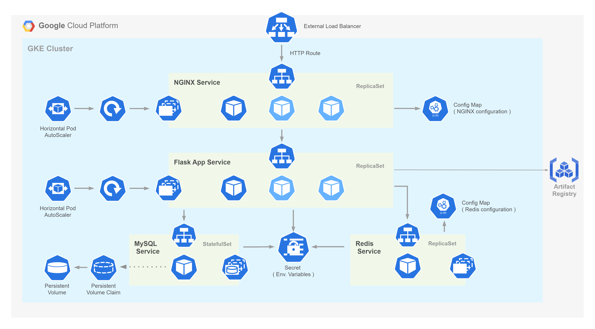

## Deploying a Fullstack Application with 3-Tier Architecture on Google Kubernetes Engine (GKE)



### Steps

1. Create a new project on Google Cloud Platform (GCP)
2. Enable the Kubernetes Engine API
3. Install the Google Cloud SDK on your local machine
4. Clone the repository and navigate to the backend directory
5. Login to Google Cloud SDK and set the project
    ```
    gcloud auth login
    gcloud config set project YOUR_PROJECT_ID
    ```
6. Enable/Install the required services
    ```
    gcloud services enable artifactregistry.googleapis.com
    gcloud auth configure-docker
    gcloud components install gke-gcloud-auth-plugin
    ```

5. Build the Docker image, replace HOST-NAME, PROJECT-ID, REPOSITORY, and IMAGE with your own values for 
    ```
    docker build -t HOST-NAME/PROJECT-ID/REPOSITORY/IMAGE:latest .
    ```
6. Push the Docker image to Google Artifact Registry
    ```
    docker push HOST-NAME/PROJECT-ID/REPOSITORY/IMAGE
    ```
3. Create a Kubernetes cluster
4. Configure kubectl to use the new cluster
    ```
    gcloud container clusters get-credentials CLUSTER_NAME --zone ZONE --project PROJECT_ID
    ```
5. Enable Gateway API for the cluster
    ```
    gcloud container clusters update CLUSTER_NAME --location=ZONE --gateway-api=standard
    ```
6. Navigate to the root directory of project, replace <DOCKER_IMAGE>, <MYSQL_PASSWORD>, <MYSQL_DATABASE_NAME> with your own values, and apply the configuration files
    ```
    kubectl apply -f deploy.yml
    ```
